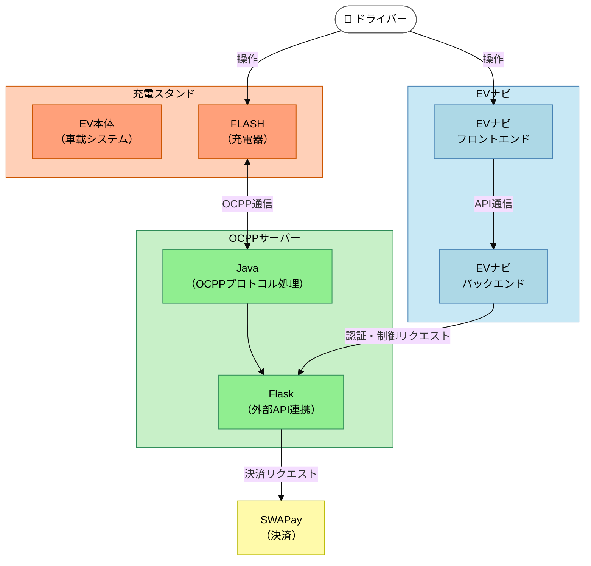

# EV充電システム - コンポーネント図

```mermaid
%%{init: {'theme': 'base', 'themeVariables': {'fontSize': '14px'}, 'flowchart': {'htmlLabels': true, 'curve': 'basis'}}}%%
flowchart TD
    Driver(["👤 ドライバー"])

    SWAPay["SWAPay<br/>（決済）"]

    subgraph ChargingStation["充電スタンド"]
        EV["EV本体<br/>（車載システム）"]
        FLASH["FLASH<br/>（充電器）"]
    end

    subgraph OCPP["OCPPサーバー"]
        JavaPart["Java<br/>（OCPPプロトコル処理）"]
        FlaskPart["Flask<br/>（外部API連携）"]
        JavaPart --> FlaskPart
    end

    subgraph EVNavi["EVナビ"]
        NaviApp["EVナビ<br/>フロントエンド"]
        NaviBackend["EVナビ<br/>バックエンド"]
        NaviApp -->|API通信| NaviBackend
    end

    Driver -->|操作| NaviApp
    Driver -->|操作| FLASH
    FLASH <-->|OCPP通信| JavaPart
    NaviBackend -->|認証・制御リクエスト| FlaskPart
    FlaskPart -->|決済リクエスト| SWAPay

    classDef navi fill:#add8e6,stroke:#4682b4,color:#000
    classDef selfdev fill:#90ee90,stroke:#2e8b57,color:#000
    classDef charging fill:#ffa07a,stroke:#cc5500,color:#000
    classDef payment fill:#fffaaa,stroke:#b8b800,color:#000
    classDef actor fill:#ffffff,stroke:#555555,color:#000

    class NaviApp,NaviBackend navi
    class JavaPart,FlaskPart selfdev
    class EV,FLASH charging
    class SWAPay payment
    class Driver actor

    style OCPP fill:#c8f0c8,stroke:#2e8b57,color:#000
    style ChargingStation fill:#ffd0b8,stroke:#cc5500,color:#000
    style EVNavi fill:#c8e8f5,stroke:#4682b4,color:#000
```

## 凡例

| 色 | 区分 |
|----|------|
| 🟩 緑 | 自社開発 |
| 🟦 青 | 外部システム（EVナビ） |
| 🟧 オレンジ | 外部システム（充電スタンド） |
| 🟨 黄 | 外部システム（決済） |
